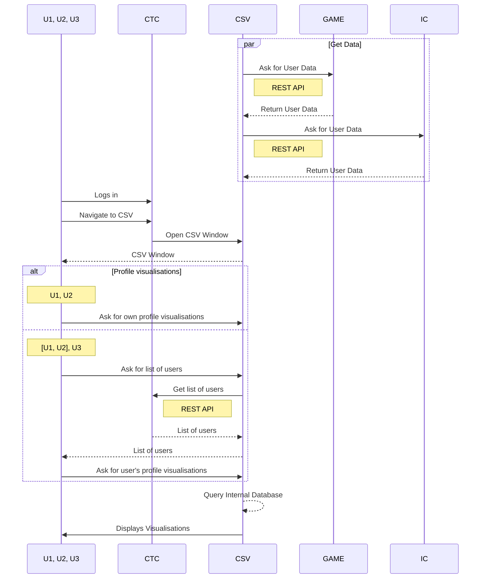

#### UC-A-01: Profile visualizations

- Trainee achievements over time plot (Req-101) 
- Trainee achievements per category over time plot (Req-102) 
- Trainee ranking over time plot (Req-104) 

```mermaid
sequenceDiagram
    participant U as U1, U2, U3
    participant CTC
    participant CSV
    participant GAME
    participant IC

    par Get Data
        CSV->>GAME: Ask for User Data
        Note right of CSV: REST API
        GAME-->>CSV: Return User Data
        CSV->>IC: Ask for User Data
        Note right of CSV: REST API
        IC-->>CSV: Return User Data
    end

    U->>CTC: Logs in
    U->>CTC: Navigate to CSV
    CTC->>CSV: Open CSV Window
    CSV-->>U: CSV Window

    alt Profile visualisations
        Note over U: U1, U2
        U->>CSV: Ask for own profile visualisations
    else
        Note over U: [U1, U2], U3
        U->>CSV: Ask for list of users
        CSV->>CTC: Get list of users
        Note left of CSV: REST API
        CTC-->>CSV: List of users
        CSV-->>U: List of users
        U->>CSV: Ask for user's profile visualisations
    end 

    CSV-->>CSV: Query Internal Database
    CSV->>U: Displays Visualisations
```
