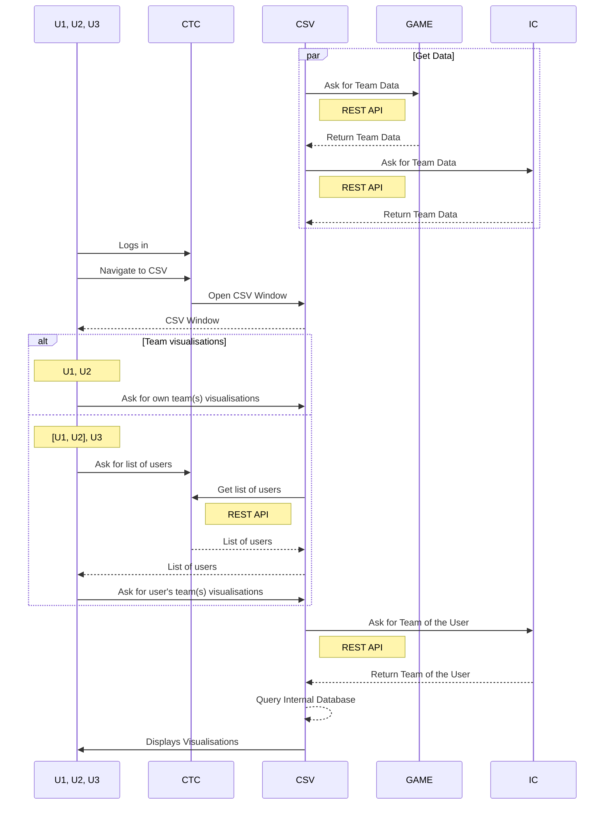

#### UC-A-02: Team visualizations

- Team achievements over time plot (Req-098)
- Team achievements per category over time plot (Req-099)
- Team ranking over time plot (Req-100)

```mermaid
sequenceDiagram
    participant U as U1, U2, U3
    participant CTC
    participant CSV
    participant GAME
    participant IC

    par Get Data
        CSV->>GAME: Ask for Team Data
        Note right of CSV: REST API
        GAME-->>CSV: Return Team Data
        CSV->>IC: Ask for Team Data
        Note right of CSV: REST API
        IC-->>CSV: Return Team Data
    end

    U->>CTC: Logs in
    U->>CTC: Navigate to CSV
    CTC->>CSV: Open CSV Window
    CSV-->>U: CSV Window

    alt Team visualisations
        Note over U: U1, U2
        U->>CSV: Ask for own team(s) visualisations
    else
        Note over U: [U1, U2], U3
        U->>CTC: Ask for list of users
        CSV->>CTC: Get list of users
        Note left of CSV: REST API
        CTC-->>CSV: List of users
        CSV-->>U: List of users
        U->>CSV: Ask for user's team(s) visualisations
    end 

    CSV->>IC: Ask for Team of the User
    Note right of CSV: REST API
    IC-->>CSV: Return Team of the User

    CSV-->>CSV: Query Internal Database
    CSV->>U: Displays Visualisations
```
