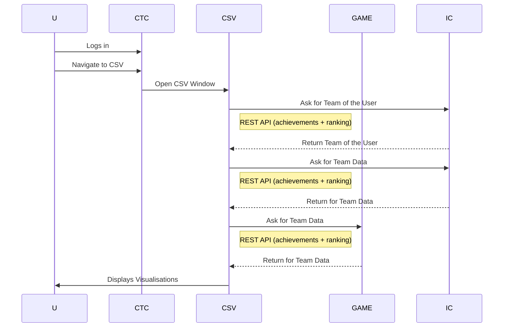

```mermaid
sequenceDiagram
    participant U
    participant CTC
    participant CSV
    participant GAME
    participant IC

    U->>CTC: Logs in
    U->>CTC: Navigate to CSV
    CTC->>CSV: Open CSV Window
    CSV->>IC: Ask for Team of the User
    Note right of CSV: REST API (achievements + ranking)
    IC-->>CSV: Return Team of the User
    CSV->>IC: Ask for Team Data
    Note right of CSV: REST API (achievements + ranking)
    IC-->>CSV: Return for Team Data
    CSV->>GAME: Ask for Team Data
    Note right of CSV: REST API (achievements + ranking)
    GAME-->>CSV: Return for Team Data
    CSV->>U: Displays Visualisations
```
