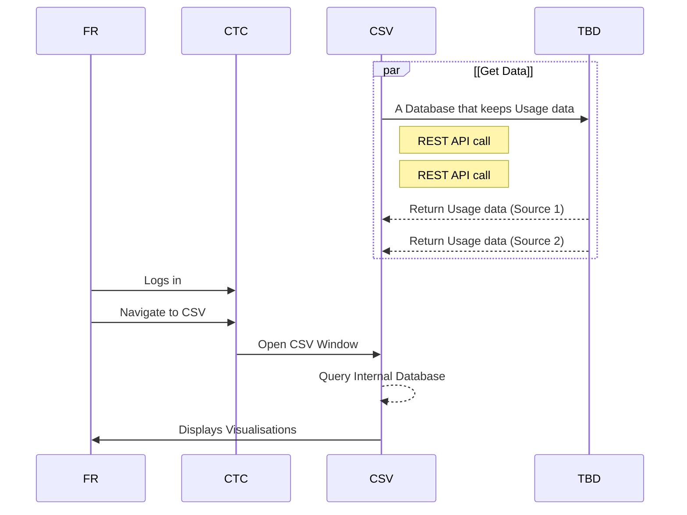

#### UC-A-03: System visualizations

```mermaid
sequenceDiagram
    participant FR
    participant CTC
    participant CSV
    participant TBD

    par [Get Data]
        CSV->>TBD: A Database that keeps Usage data
        Note right of CSV: REST API call
        Note right of CSV: REST API call
        TBD-->>CSV: Return Usage data (Source 1)
        TBD-->>CSV: Return Usage data (Source 2)
    end

    FR->>CTC: Logs in
    FR->>CTC: Navigate to CSV
    CTC->>CSV: Open CSV Window
    CSV-->>CSV: Query Internal Database
    CSV->>FR: Displays Visualisations
```
