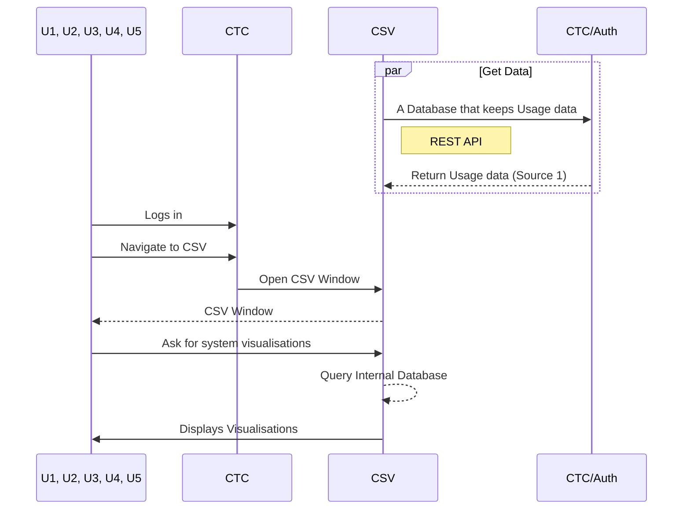

#### UC-A-03: System visualizations

- Active users and teams over time plot (Req-083) 
- Users per weekday plot (Req-084) 
- Users per hour of day plot (Req-085) 
- Users per month plot (Req-086) 
- Users per challenge category plot (Req-088) 

