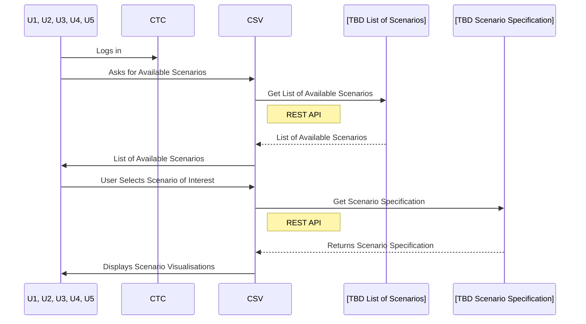

#### UC-A-04: Challenge – Labs – Exercises visualizations

```mermaid
sequenceDiagram
    participant U as U1, U2, U3, U4, U5
    participant CTC
    participant CSV
    participant TBD1 as [TBD List of Scenarios]
    participant TBD2 as [TBD Scenario Specification]

    U->>CTC: Logs in
    U->>CSV: Asks for Available Scenarios
    CSV->>TBD1: Get List of Available Scenarios
    Note right of CSV: REST API
    TBD1-->>CSV: List of Available Scenarios
    CSV->>U: List of Available Scenarios
    U->>CSV: User Selects Scenario of Interest
    CSV->>TBD2: Get Scenario Specification
    Note right of CSV: REST API
    TBD2-->>CSV: Returns Scenario Specification

    CSV->>U: Displays Scenario Visualisations
```
