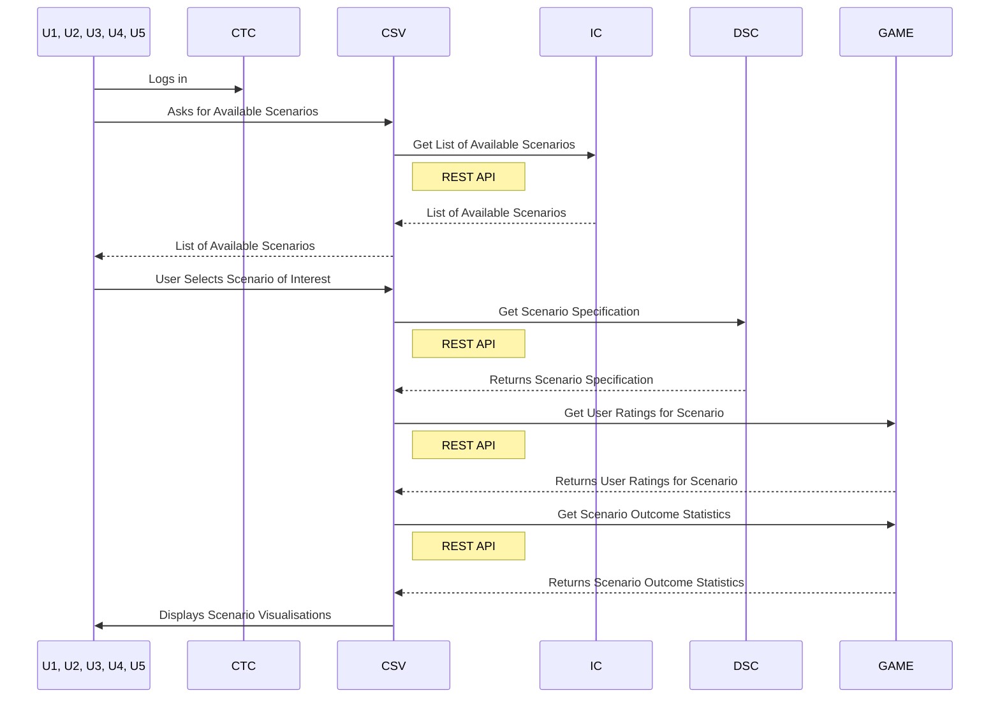

#### UC-A-04: Challenge – Labs – Exercises visualizations

- Scenario network graph (Req-094) 
- VM details pop-up on network graph (Req-095) 
- Difficulty ratings from users graph (Req-096) 
- Times played and Outcomes over time graph (Req-097) 

